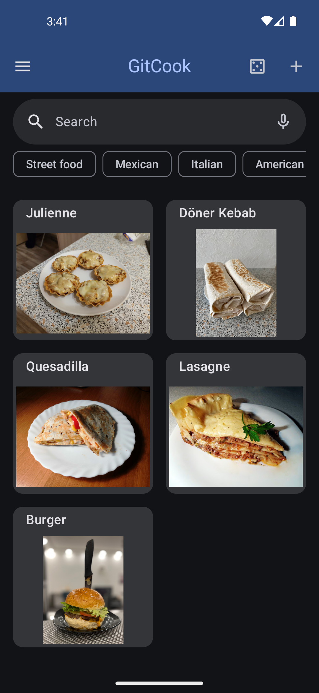
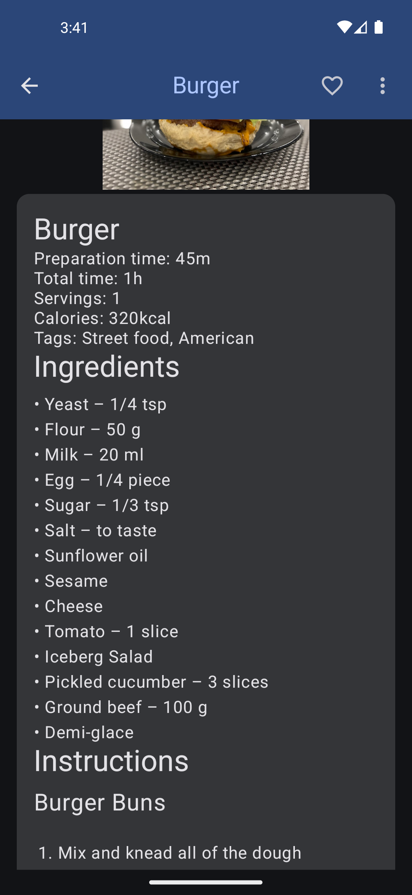

# GitCook Project

## Project Description

The app allows users to store and manage recipes efficiently and includes features that help track different versions of a recipe, making it easy to experiment with new ideas.

The project leverages **Jetpack Compose** for building a modern, responsive UI, and follows **MVVM architecture** to ensure the code is maintainable and scalable. I intentionally avoided using third-party libraries in key areas like **markup parsing** and **notification handling** to showcase my ability to solve common problems using native Android tools.

One of the app's unique features is its **Git-like functionality** for recipes, allowing users to create branches, commit changes, and tag different versions of their recipes to track what worked and what didn’t. 

In future updates, I plan to add a **scheduler** that will allow users to plan their daily meals and calculate the total energy and nutritional intake for the day, making it a practical tool for meal planning and nutrition tracking.

This project is still in development, with many planned features outlined in the related issues section. It reflects my ability to build feature-rich applications, with design clean architectures, and continually improve a product based on user needs and personal interests.

## Key Features

- Custom-built markup parser (no third-party libraries used)
- Fully functional UI using Jetpack Compose
- MVVM architecture for maintainable and testable code
- Data persistence with Room database
- State management with `State` and `Flow`
- Asynchronous programming using Kotlin Coroutines
- In-app notification handling with native Android solutions
- Full-text search for recipes
- Unit testing with JUnit
- Full R8 obfuscation and minification support

## Screenshots

| Home Screen | Detail Screen |
| -------------------------------| -------------------------------|
|  |  |
|  |  |

## Installation and Setup

You can try the app directly by downloading it from [Releases](https://github.com/AidarNurmukhametov/gitcook/releases) page.

Alternatively, if you want to run the app locally:

1. Clone the repository:

   ```bash
   git clone https://github.com/AidarNurmukhametov/gitcook.git
   ```

2. Open the project in Android Studio.
3. Build the project by selecting **Build > Make Project**.
4. Run the project on an emulator or connected device.

## Technologies Used

- **Kotlin** for modern Android development
- **Jetpack Compose** for declarative UI
- **Coroutines** for asynchronous programming
- **Hilt** for dependency injection
- **Room** for local database storage
- **JUnit** for unit testing
- **Jetpack Compose Testing Library** for UI testing
- **BaselineProfileGenerator** for better startup performance

## Architecture

The project is structured following the **MVVM (Model-View-ViewModel)** architecture, ensuring separation of concerns and making the code easier to test and maintain. The codebase follows **Clean Architecture** principles, separating the UI, business logic, and data layers.

## Why This Project?

I started this project for two main reasons. First, to showcase some (though not all) of my Android development skills. I chose Jetpack Compose because I hadn’t yet used it in a personal project. Additionally, I aimed to avoid relying on third-party libraries to demonstrate how I can tackle various challenges, such as parsing markup and handling notifications, using native tools.

The second reason is that I love cooking, and I needed an app to efficiently store all my recipes and make interacting with them easy. Since I also enjoy experimenting, I incorporated some Git-like functionality (branches, commits, and tags) to track which ideas worked well and which didn’t. This is not the final version of the app, as I plan to add many more features, which you can find in the related issues section.

## Future Improvements

In the future, I plan to:

- Allow users to create branches, commit changes, and tag different versions of recipes manually
- Add sharing recipes via **Android Beam**
- Add a **scheduler** to plan daily meals from recipes for a week
- Support more git commands like **diff** and **merge**
- Rework design to comply with **A11y** standards
- Add even more **unit tests** and **UI tests** to cover more use cases
- Add performance tests for critical user journeys

## Contact

Feel free to reach out via:
- **Email:** aidar.nur@gmail.com
- **LinkedIn:** [Your LinkedIn Profile](https://www.linkedin.com/in/aidar-nurmukhametov-067398246/)

## Contribution

This project is intended to showcase my skills in Android development and is not currently open for contributions. However, you are welcome to fork the repository and modify the project to suit your own needs or to experiment with the code.

If you have any suggestions or feedback, feel free to reach out through the contact information provided.

## AI Generated Content

The README.md and translations were generated using **GPT-4o** to save time and ensure the content is comprehensive and informative. The content was then manually reviewed to ensure accuracy and relevance.

## License

This project is licensed under the Apache 2.0 License - see the [LICENSE](LICENSE) file for details.
